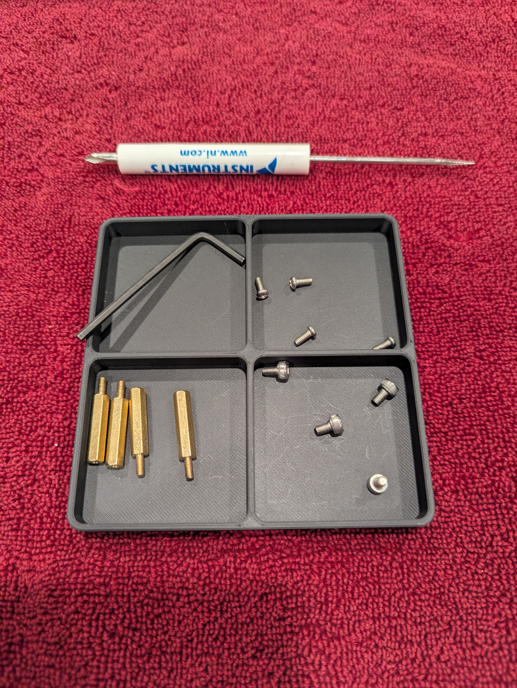

# Aviation Weather Display

A Flask-based web application that fetches and displays real-time METAR (Meteorological Aerodrome Report) data for up to three airports simultaneously. The airports can be changed by typing in a different airport code for each column. 

## Software

### Features

- **Real-time METAR Data**: Fetches current weather observations from the Aviation Weather API
- **Multi-Airport Support**: Display weather for up to three airports simultaneously
- **Automatic Calculations**:
  - Pressure altitude
  - Density altitude
- **Flight Categories**: Visual indicators for VFR, MVFR, IFR, and LIFR conditions
- **Persistent Storage**: Remembers your selected airports using localStorage after you close the browser
- **Raspberry Pi Compatible**: Can be deployed as a fullscreen kiosk display

### Technologies

- **Backend**: Python 3, Flask
- **Frontend**: HTML, CSS, TypeScript
- **API**: Aviation Weather Center (aviationweather.gov)

### Project Structure

```
Python_Aviation_Weather/
├── aviationWeatherGovAPI.py   # Flask application and API routes
├── Metar.py                    # METAR data parser and calculator
├── index.html                  # Main web interface
├── styles.css                  # Styling
├── Typescript/
│   ├── eventListeners.ts       # TypeScript source
│   ├── eventListeners.js       # Compiled JavaScript
│   └── tsconfig.json          # TypeScript configuration
├── Visual_Assets/             # Images and graphics
└── venv/                      # Python virtual environment
```

### Installation

1. **Clone the repository**
   ```bash
   git clone https://github.com/LCXCRunner/Python_Aviation_Weather.git
   cd Python_Aviation_Weather
   ```

2. **Create and activate a virtual environment**
   ```bash
   python -m venv venv
   # Windows
   venv\Scripts\activate
   # Linux/Mac
   source venv/bin/activate
   ```

3. **Install dependencies**
   ```bash
   pip install -r requirements.txt
   ```

4. **Compile TypeScript (optional)**
   ```bash
   cd Typescript
   tsc
   ```

### Usage

#### Development Mode

Run the Flask application:
```bash
python aviationWeatherGovAPI.py
```

Visit `http://localhost:5000` in your web browser.

#### Debugging in VS Code

##### Flask Instance

1. Ensure proper `launch.json` configuration for Flask debugging
2. Select "Python: Flask Debug" configuration
3. Press F5 to start debugging

##### Flask and Event Listeners

1. Ensure proper `launch.json` configuration for Flask + Typescript debugging
2. Select "Flask + TypeScript Debug" configuration
3. Press F5 to start debugging, make sure the flask app is running and you are accessing the `http://localhost:5000` on your browser. You can then click buttons, typing in inputs, ect to debug. 

### Deployment

#### Raspberry Pi Kiosk Setup

The project includes instructions for deploying on a Raspberry Pi as a fullscreen kiosk display. It is assume that this section takes place on a raspberry pi. A 4b model was used in the initial project. 

1. **Create systemd service** (`/etc/systemd/system/flaskapp.service`):
   ```ini
   [Unit]
   Description=Flask App
   After=network-online.target

   [Service]
   User=<user>
   WorkingDirectory=/home/<user>/Documents/Python_Aviation_Weather
   ExecStart=/usr/bin/python /home/<user>/Documents/Python_Aviation_Weather/aviationWeatherGovAPI.py
   Restart=always
   Environment="FLASK_ENV=production"

   [Install]
   WantedBy=multi-user.target
   ```

2. **Enable and start the service**:
   ```bash
   sudo systemctl enable flaskapp.service
   sudo systemctl start flaskapp.service
   sudo systemctl status flaskapp.service
   ```

3. **Create desktop launcher** for Chromium fullscreen mode:
   ```bash
   #!/bin/bash
   /usr/bin/chromium-browser http://localhost:5000 --start-fullscreen \
     --disable-gpu --disable-software-rasterizer \
     --disable-accelerated-2d-canvas --disable-infobars \
     --disable-session-crashed-bubble --no-sandbox \
     --force-device-scale-factor=0.67
   ```
   NOTE: F11 to exit fullscreen mode

   To make the file executable on Raspbian:
   ```bash
     --chmod +x /home/jakeg/Desktop/launch_flask_app.sh
   ```
   I recommend leaving this executable file on the Raspbian desktop for easy access. 

4. **Changing the .service file will require you to restart the systemctl deamon if you are troubleshooting**
    ```bash
    sudo systemctl daemon-reload
    sudo systemctl restart flaskapp.service
    systemctl status flaskapp.service
    ```
    Restart it if needed and then check if it is running again. This step may or may not be needed. 

### API Endpoints

#### `GET /`
Serves the main HTML interface

#### `GET /styles.css`
Serves the stylesheet

#### `GET /Typescript/eventListeners.js`
Serves the compiled JavaScript

#### `POST /get-metar`
Fetches METAR data for a specified airport

**Request Body:**
```json
{
  "airport": "KSLC"
}
```

**Response:**
```json
{
  "success": true,
  "airport": "KSLC",
  "observationTime": "December 22, 2025 18:53 UTC",
  "temperature": 32,
  "dewpoint": 25,
  "altimeter": 30.12,
  "pressureAltitude": 4220,
  "densityAltitude": 3890,
  "windSpeed": 8,
  "windDirection": 160,
  "windGust": null,
  "visibility": 10,
  "clouds": [...],
  "weather": [...],
  "flightCategory": "VFR"
}
```

### Data Sources

Weather data is retrieved from the [Aviation Weather Center API](https://aviationweather.gov/), which provides official METAR observations from airports worldwide.

## Bill of Material

### Electronics

| Component | Model/Specs | Quantity | Purpose | Link |
|-----------|-------------|----------|---------|---------|
| Single Board Computer | Raspberry Pi 4B | 1 | Main computing unit | https://www.raspberrypi.com/documentation/computers/raspberry-pi.html#flagship-models-since-raspberry-pi-4b-compute-modules-since-cm5-keyboard-models-since-pi-400 |
| Display | 7" HDMI Touchscreen | 1 | Weather data display | https://www.raspberrypi.com/documentation/accessories/display.html |
| Power Supply | 5V 3A USB-C | 1 | Power for Raspberry Pi |
| MicroSD Card | 32GB Class 10 | 1 | Operating system storage |

Note: these are simply the parts used for the original build. A smaller computer or SD card are easily possible. Though, a different form factor computer will not fit in the 3D printed case as easily. 

### 3D Printed Parts
Many printers will do to produce the parts used in this project. 
For the original build, a Bambu Labs X1C was used. The 3D slicer used was Bambu Studio.
Various filiments will also be okay for this build. The original build used PLA Matte from Bambu Labs. 

| Component | File | Quantity | Picture | 
|-----------|-------------|----------|---------|
| Screen Holder | "Screen Holder.stl | 1 | "" |
| Screen Back | "Screen Back.stl" | 1 | "" |
| Pi Cover | "Pi Cover.stl" | 1 | "" |
| Pi Cover Top | "Pi Cover Top.stl | 1 | "" |
| Full Print Settings | "Python_Aviation_Weather_Full_Print.3mf | 1 | "" |

### Fasteners

| Component | Quantity |
|-----------|----------|
| M2.5 x 6mm Screw | 4 |
| M3 x 5mm | 4 |
| M2.5 x 20+3mm Stand off| 4 |

Picture of fasteners: 



## Author

Jake G. ([@LCXCRunner](https://github.com/LCXCRunner))

## Acknowledgments

- Aviation Weather Center for providing the METAR API
- Built for the aviation community and computer/engineering hobbiests
